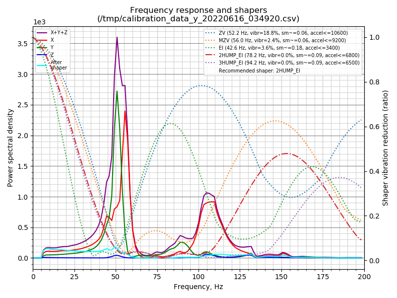

# Flsun-Q5-Ultimate-frame-mod
If you need elp or have questions, ty88#4122

The squishy wobbly motion system on the Q5 left a lot to be desired soo...

## stage 1        

 

Some reason I can't get a Clipper to Output the x-axis PNG thing 

 

### stock tower support next to upgrade 

 

 The belt now goes all the way through the frame and into a bottom plate,
 
 Idler is held on both sides, none of that cantilever nonsense. 

 

 
In this picture the Alpha tower carriage is bottomed out against bottom tower support,
this upgrade is not supposed to reduce max printable radius but Is this **highly recommended** to reduce it to at least 96MM. 
